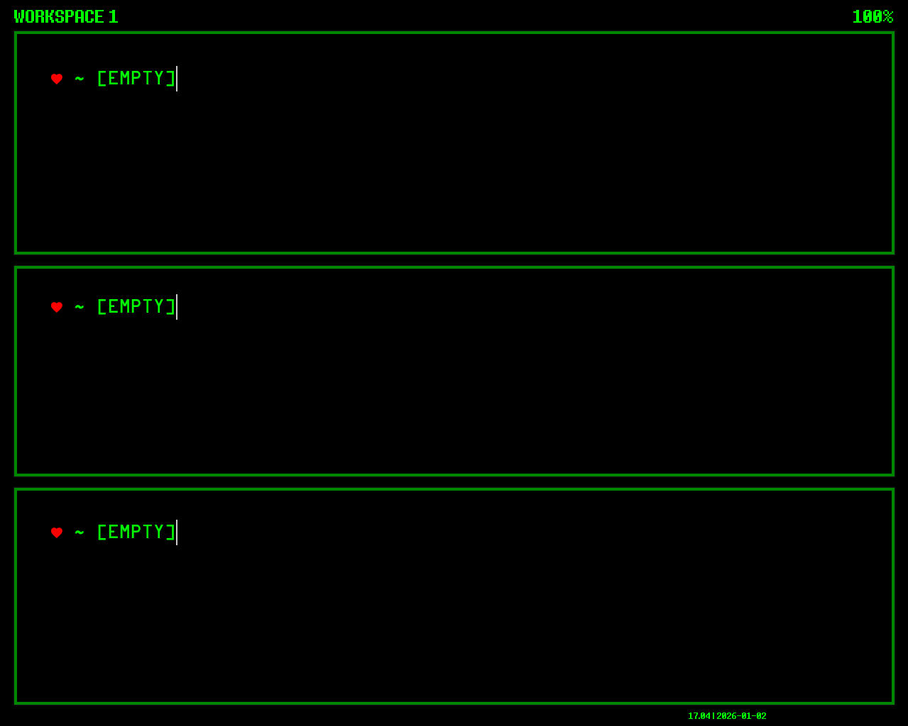
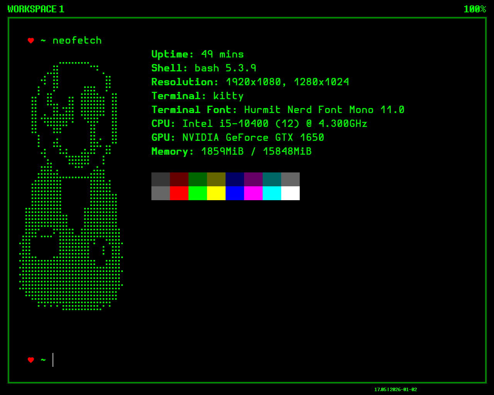
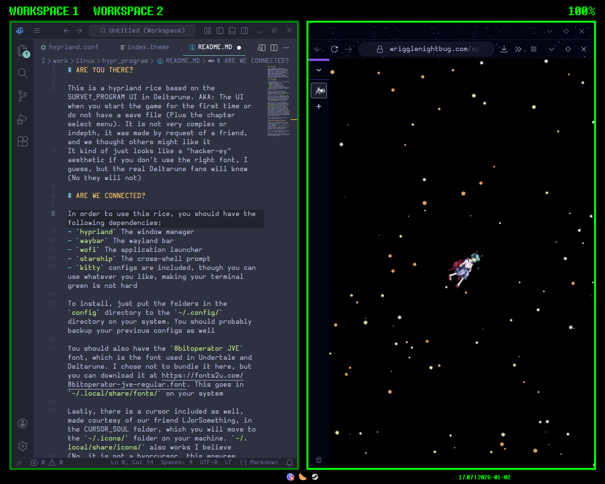
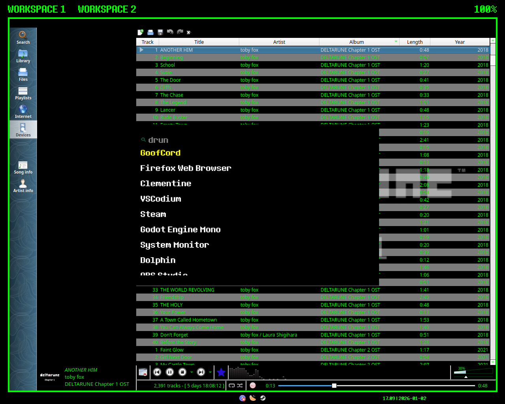
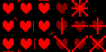

# SURVEY_LAND
## ARE YOU THERE?

This is a hyprland rice based on the SURVEY_PROGRAM UI in Deltarune. AKA: The UI when you start the game for the first time or do not have a save file (Plus the chapter select menu). It is not very complex or indepth, it was made by request of a friend, and we thought others might like it
It kind of just looks like a "hacker-ey" aesthetic if you don't use the right font, I guess, but the real Deltarune fans will know

|  |  |
| --- | --- |
|  |  |

## ARE WE CONNECTED?

In order to use this rice, you should have the following dependencies:
- `hyprland` The window manager
- `waybar` The wayland bar
- `wofi` The application launcher
- `starship` The cross-shell prompt
- `kitty` configs are included, though you can use whatever you like, making your terminal green is not hard

To install, just put the folders in the `config` directory to the `~/.config/` directory on your system. You should probably backup your previous configs as well

This also includes the `8bitoperator JVE` font, which is the font used in Undertale and Deltarune, and the waybar theme in particular expects you to have this. This goes in `~/.local/share/fonts/` on your system

 
Lastly, there is a cursor included as well, made courtesy of our friend LJorSomething, in the CURSOR_SOUL folder, which you will move to the `~/.icons/` folder on your machine. `~/.local/share/icons/` also works I believe
 (No, it is not a hyprcursor, this ensures better compatability with all programs, and you, the end user, will probably not notice the difference unless you have an 8K screen, as Vaxry says on the blogpost. You do not have an 8K screen. I know hyprcursor is better on the technical side, it is not well compatible with many programs and shells. And think about it as a bonus, now KDE users and GNOME freaks can use this cursor too)

You will probably need to edit the config files to your liking as well

## HOW DO YOU FEEL ABOUT YOUR CREATION?

There are a few missing features, you won't really notice, but I would like to make them work at some point
- Kitty refuses to load the 8bitoperator font. I do not know why
- Unable to move the program icons in wofi to the right side of the menu. Is that even possible? I feel like it should be

You are free to make Github issues if problems arise, or if you have suggestions/fixes

Deltarune was made by Toby Fox, obviously, and therefore the heart sprite used in the cursor was also made by Toby Fox
